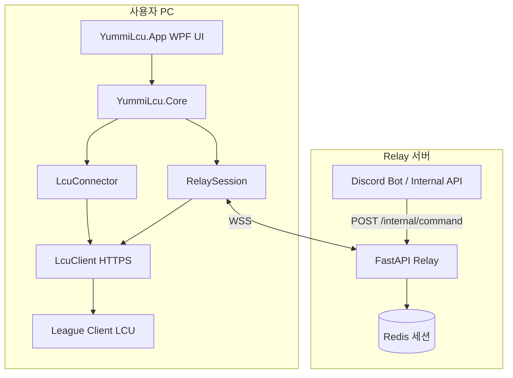
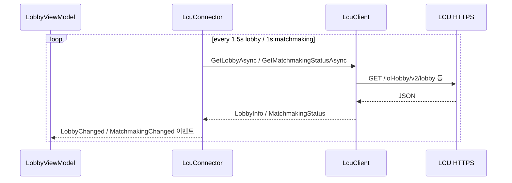
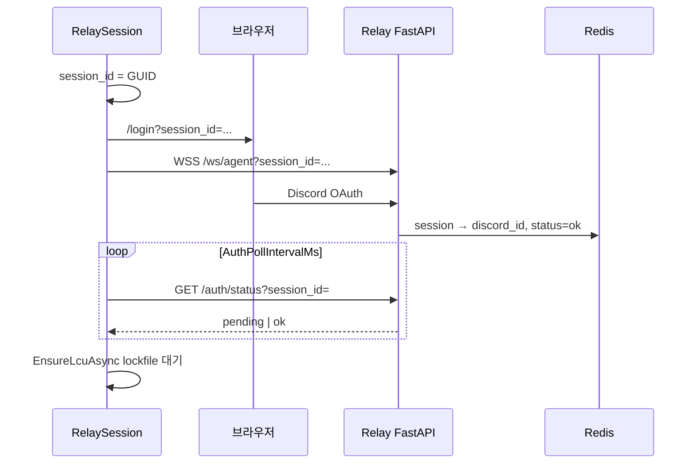
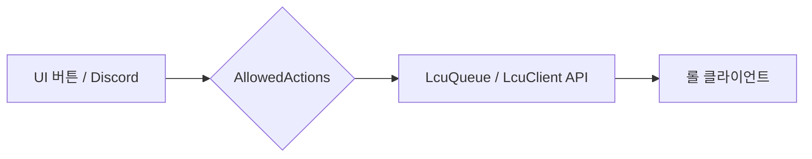
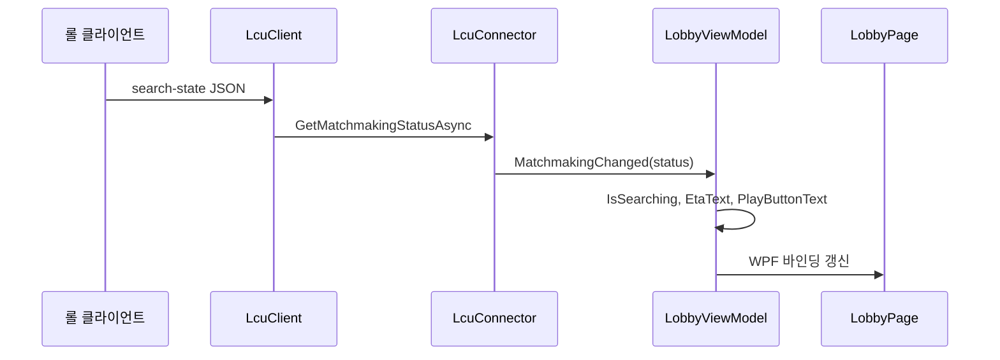

# YummiLcu Agent — 작동 원리와 메커니즘

이 문서는 **Windows 에이전트(`YummiLcu.App`)**, **공유 라이브러리(`YummiLcu.Core`)**, **Relay 서버(Python/FastAPI)**, **로컬 LCU(리그 클라이언트 API)** 가 어떻게 연결되어 동작하는지 설명합니다.

---

## 1. 한 줄 요약

에이전트는 **내 PC에서 실행되는 작은 프로그램**으로, 두 가지 통로를 동시에 다룹니다.

| 통로 | 역할 |
|------|------|
| **Relay (인터넷)** | Discord 봇·웹이 “이 유저 PC에 명령 보내기” |
| **LCU (로컬 HTTPS)** | 실제 롤 클라이언트에 로비·매칭·상메 등 적용 |

UI(WPF)는 사람이 버튼을 누를 때 **같은 LCU API**를 쓰고, Discord 경로는 **Relay → WebSocket → 에이전트 → LCU** 순으로 갑니다.

---

## 2. 전체 구성도



### 프로젝트 역할

| 경로 | 설명 |
|------|------|
| `agent/YummiLcu.App/` | WPF 화면, MVVM, 테마, 페이지 전환 |
| `agent/YummiLcu.Core/` | LCU HTTP, Relay WebSocket, 설정, 테스트 시뮬레이터 |
| `relay/` | OAuth, 에이전트 WS, 봇용 internal HTTP |
| `deploy/` | 버전 manifest, VM 배포 스크립트 |

---

## 3. LCU(Local Client Update) 연결 메커니즘

롤 클라이언트는 로컬에서 **HTTPS API**를 열고, 인증 정보는 **lockfile** 한 줄에 담깁니다.

### 3.1 lockfile 형식

일반적으로 `호스트:포트:포트:비밀번호:...` 형태입니다. 에이전트는 **3번째 필드(포트)** 와 **4번째 필드(비밀번호)** 를 읽어 `https://127.0.0.1:{port}` 에 Basic 인증(`riot:{password}`)으로 접속합니다.

구현: [`LcuClient.TryFromLockfile`](../agent/YummiLcu.Core/Lcu/LcuClient.cs)

### 3.2 lockfile 찾기 순서

1. `agent.json`의 `LockfilePath` (환경 변수 확장 가능)
2. 환경 변수 `YUMMI_LCU_LOCKFILE`
3. 기본 경로 스캔 (`C:\Riot Games\...`, `%LocalAppData%\Riot Games\...`)

클라이언트가 lockfile을 **잠그고 있어도** `FileShare.ReadWrite`로 읽기를 재시도합니다.

### 3.3 LcuClient vs LcuConnector

| 클래스 | 용도 |
|--------|------|
| **`LcuClient`** | HTTP GET/POST/PATCH/DELETE, JSON 파싱, API 한 메서드 = 한 엔드포인트 |
| **`LcuConnector`** | UI·ViewModel용 **진입점**. 연결/해제, 폴링 루프, 테스트 모드 분기, `RunActionAsync` |

UI는 보통 `ILcuConnector`만 사용합니다.  
Relay 쪽 `RelaySession`은 **자체 `LcuClient` 인스턴스**를 따로 들고 있어, UI 연결과 독립적으로 Discord 명령을 처리할 수 있습니다.

### 3.4 상태 폴링 (Watch Loop)

LCU는 WebSocket 푸시를 에이전트가 쓰지 않고, **주기적 HTTP 폴링**으로 UI를 갱신합니다.



| 폴링 | 간격(대략) | 담당 |
|------|-----------|------|
| 로비 | 1.5초 | `LobbyWatchAsync` |
| 매칭 | 검색 중 1초 / 대기 2.5초 | `MatchmakingWatchAsync` |
| 챔프 선택 페이지 | 1.5초 | `ChampSelectViewModel` 타이머 |

`RelaySession`에도 동일한 로비·매칭 워치 루프가 있어, Relay만 켜도 Discord 명령에 필요한 LCU 상태를 유지합니다.

---

## 4. Relay + Discord 인증 메커니즘

원격에서 “내 PC의 롤”을 제어하려면, **어떤 Discord 계정의 PC인지** 먼저 증명해야 합니다.

### 4.1 세션 ID와 OAuth



1. 에이전트가 **랜덤 `session_id`** 생성  
2. 브라우저로 `RelayPublicBaseUrl/login?session_id=...` 열기 → Discord 로그인  
3. 동시에 **WebSocket** `wss://.../ws/agent?session_id=...` 연결  
4. Relay가 Redis에 `discord_id` 저장  
5. 에이전트가 `/auth/status`를 **폴링**하다 `ok` 수신  
6. 이후 해당 WS는 `discord_id`에 **바인딩** (`ConnectionManager`)

설정: [`AgentConfig`](../agent/YummiLcu.Core/AgentConfig.cs) — `RelayPublicBaseUrl`, `AuthPollIntervalMs`

### 4.2 Discord 봇 → PC 명령

봇(또는 내부 도구)은 Relay에 HTTP로 명령을 넣습니다.

```
POST /internal/command
Header: X-Relay-Internal-Secret: ...
Body: { "discord_id": 123, "action": "queue_start", "payload": {} }
```

Relay는 `discord_id`에 연결된 **에이전트 WebSocket**으로 JSON을 push합니다.

```json
{
  "type": "command",
  "action": "queue_start",
  "request_id": "a1b2c3d4",
  "payload": { "text": "..." }
}
```

에이전트 [`RelaySession.HandleMessageAsync`](../agent/YummiLcu.Core/Relay/RelaySession.cs)가 수신 → **화이트리스트** 검사 → `AllowedActions.ExecuteAsync` → `LcuClient` HTTP 호출.

화이트리스트는 C# [`AllowedActions`](../agent/YummiLcu.Core/Lcu/AllowedActions.cs)와 Python [`relay/actions.py`](../relay/actions.py)에서 **동일한 action 이름**을 유지해야 합니다.

---

## 5. Action(명령) 처리 파이프라인

모든 “무엇을 할지”는 **문자열 action** 하나로 통일됩니다.



### 대표 action과 LCU 동작

| action | LCU 동작 (요약) |
|--------|------------------|
| `create_ranked_lobby` | DELETE 로비 → POST `/lol-lobby/v2/lobby` queueId=420 |
| `queue_start` | POST `.../matchmaking/search` |
| `queue_cancel` | DELETE `.../matchmaking/search` |
| `leave_lobby` | DELETE `/lol-lobby/v2/lobby` |
| `set_status` | GET `/lol-chat/v1/me` 병합 후 PUT 상메 |
| `accept_match` | POST ready-check accept |
| `play_ranked_solo` | 로비 생성 + 매칭 시작 (재시도 포함) |
| `launch_client` | Riot Client 실행 (LCU 불필요) |

로비·매칭 일괄 처리: [`LcuQueue`](../agent/YummiLcu.Core/Lcu/LcuQueue.cs)

---

## 6. WPF UI (MVVM) 메커니즘

### 6.1 시작 흐름

[`App.xaml.cs`](../agent/YummiLcu.App/App.xaml.cs):

1. (선택) `UpdateChecker` — manifest 버전 비교 후 zip 자동 교체  
2. `AgentConfig.Load()` — 실행 폴더 옆 `agent.json`  
3. `LcuConnector` 생성, `UiTestMode`면 테스트 하네스 활성  
4. `ShellViewModel` + `MainWindow` 표시  

### 6.2 Shell + 페이지

| 구성요소 | 역할 |
|----------|------|
| `ShellViewModel` | 현재 페이지, Relay 시작/중지, 테마, 로그, 테스트 모드 |
| `HomeViewModel` | 소환사, 상메, lockfile, LCU 연결 |
| `LobbyViewModel` | 로비/매칭 UI, 친구 목록, `RunActionAsync` |
| `ChampSelectViewModel` | 챔프선 세션 폴링, 픽/밴, 룬 페이지 |

페이지 전환: `ContentControl` + `DataTemplate`(ViewModel 타입별 View) + [`NavigationService`](../agent/YummiLcu.App/Services/NavigationService.cs) Fade 애니메이션.

### 6.3 테마 (DynamicResource)

`Themes/CatTheme.xaml` 등에 `LcuBg`, `LcuPanel`, `LcuAccent`, `LcuSubAccent`, `LcuText` 브러시를 정의합니다.

[`ThemeService`](../agent/YummiLcu.App/Services/ThemeService.cs)가 `Application.Current.Resources.MergedDictionaries`에서 **테마 딕셔너리만 교체**합니다. XAML은 `{DynamicResource LcuBg}`로 바인딩하므로 **런타임에 색이 즉시 바뀝니다**.

---

## 7. 테스트 모드 메커니즘

`agent.json` → `UiTestMode: true` 또는 UI 체크박스.

| 항목 | 실제 모드 | 테스트 모드 |
|------|-----------|-------------|
| LCU HTTP | `LcuClient` | 사용 안 함 |
| Relay | 선택 | 사용 안 함 (UI만) |
| 로비/매칭 | LCU API | [`UiTestHarness`](../agent/YummiLcu.Core/UiTestHarness.cs) 메모리 시뮬 |
| 타이머 | LCU 응답 | 1초마다 경과 시간 증가 |

`LcuConnector.SetTestMode(true)` → `UiTestHarness.Start()` → `RunActionAsync`가 하네스로 분기.

UI 개발·레이아웃 확인용이며, **실제 게임 상태와는 무관**합니다.

---

## 8. 자동 업데이트 메커니즘

1. 시작 시 `UpdateManifestUrl`(예: `.../agent-version.json`) GET  
2. manifest `version` > 현재 어셈블리 버전이면 zip URL 다운로드  
3. [`AgentUpdater`](../agent/YummiLcu.Core/AgentUpdater.cs)가 임시 폴더에 풀고 **cmd 스크립트**로  
   - 프로세스 종료 대기 → `robocopy`로 publish 폴더 덮어쓰기 → `YummiLcu.App.exe` 재실행  
4. `agent.json`은 가능하면 유지 (`robocopy /XF agent.json`)

배포 manifest: [`deploy/agent-version.json`](../deploy/agent-version.json) — CI 빌드 시 csproj `<Version>`과 동기화.

---

## 9. 닷지 후 매칭 방지 (게임플로 감시)

`PreventQueueAfterDodge: true`일 때 [`RelaySession.GameflowWatchLoopAsync`](../agent/YummiLcu.Core/Relay/RelaySession.cs):

1. 주기적으로 `GET /lol-gameflow/v1/gameflow-phase`  
2. 이전 phase가 `ChampSelect`이고 현재가 `Lobby` 또는 `None`이면  
3. `DELETE .../matchmaking/search` — 챔프선 끝난 뒤 **자동으로 큐 재시작되는 것을 끊음**

---

## 10. 데이터가 UI까지 오는 경로 (예: 매칭 중)



---

## 11. 보안·신뢰 경계

| 경계 | 내용 |
|------|------|
| LCU | localhost HTTPS만, lockfile 비밀번호로 보호 — **해당 PC 로그인 세션과 동일 권한** |
| Relay WS | `session_id` + Discord OAuth로 에이전트 소유자 식별 |
| Internal API | `X-Relay-Internal-Secret` — 봇만 명령 주입 가능 |
| Action 화이트리스트 | 임의 HTTP 경로 호출 불가, 등록된 action만 |

에이전트는 **사용자가 실행·로그인한 PC에서만** LCU를 조작합니다. Relay 서버는 LCU에 직접 접속하지 않습니다.

---

## 12. 자주 헷갈리는 점

**Q. UI에서 LCU 연결과 Relay 시작은 따로인가요?**  
A. 네. UI용 `LcuConnector`와 Relay용 `RelaySession`이 **각각** lockfile로 LCU에 붙을 수 있습니다. 보통 둘 다 켜도 되고, 테스트 모드에서는 둘 다 LCU 없이 UI만 동작합니다.

**Q. Discord 명령이 안 먹혀요.**  
A. Relay WS 연결 + OAuth `ok` + 해당 `discord_id`로 봇이 `/internal/command`를 쐈는지 + LCU lockfile 연결 순으로 확인하세요.

**Q. API 경로가 문서와 다릅니다.**  
A. 롤 패치마다 LCU 스키마가 바뀝니다. 에이전트는 일부 엔드포인트만 구현하며, 실패 시 로그와 LCU 응답을 확인해야 합니다.

**Q. 빌드 산출물 이름이 바뀌었나요?**  
A. WinForms `YummiLcu.Agent.exe` → WPF **`YummiLcu.App.exe`** (v0.4.0+).

---

## 13. 관련 파일 빠른 찾기

| 궁금한 것 | 파일 |
|-----------|------|
| lockfile → HTTP | `YummiLcu.Core/Lcu/LcuClient.cs` |
| UI LCU 진입점 | `YummiLcu.Core/Lcu/LcuConnector.cs` |
| Discord WS + 명령 | `YummiLcu.Core/Relay/RelaySession.cs` |
| action 목록 | `YummiLcu.Core/Lcu/AllowedActions.cs`, `relay/actions.py` |
| Relay OAuth/WS | `relay/app.py` |
| 메인 UI | `YummiLcu.App/ViewModels/ShellViewModel.cs` |
| 설정 | `agent.json`, `AgentConfig.cs` |
| 사용 가이드 | [`agent/README.md`](../agent/README.md) |

---

*문서 버전: WPF 에이전트 0.4.x 기준*
